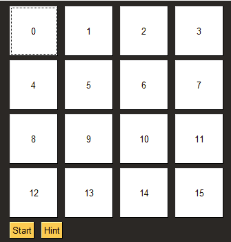

# Lights Out
A gui to run the game of lights out.

## How to play
Click a tile to turn off the light of that tile and all neighboring tiles. The goal is to turn all the lights off (make the grid white). You can ask for hints.

## How to run the project
Run lights_out_app.py

### Modules needed
PySimpleGUI, numpy, copy, math, itertool, random

### Python version
3.6
